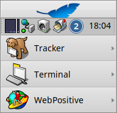

 **WorkspaceNumber** for [Haiku](https://www.haiku-os.org)

* * *

WorkspaceNumber is a Deskbar replicant to display the current workspace number.   
It helps keeping track of the current workspace in case you have similar or the same Desktop backgrounds across your workspaces.

To remove WorkspaceNumber from Deskbar launch it again or right-click the icon and select _Quit_.

WorkspaceNumber was originally developed in 1999 for the BeOS by Michał Kowalski, who used the Pulse application to learn about handling of Deskbar replicants.

